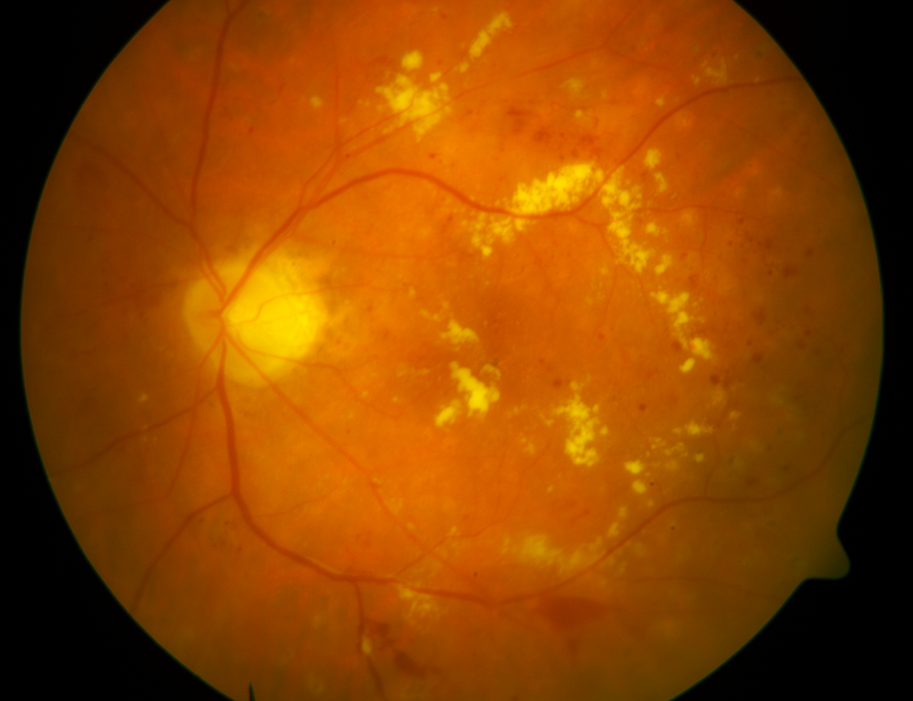
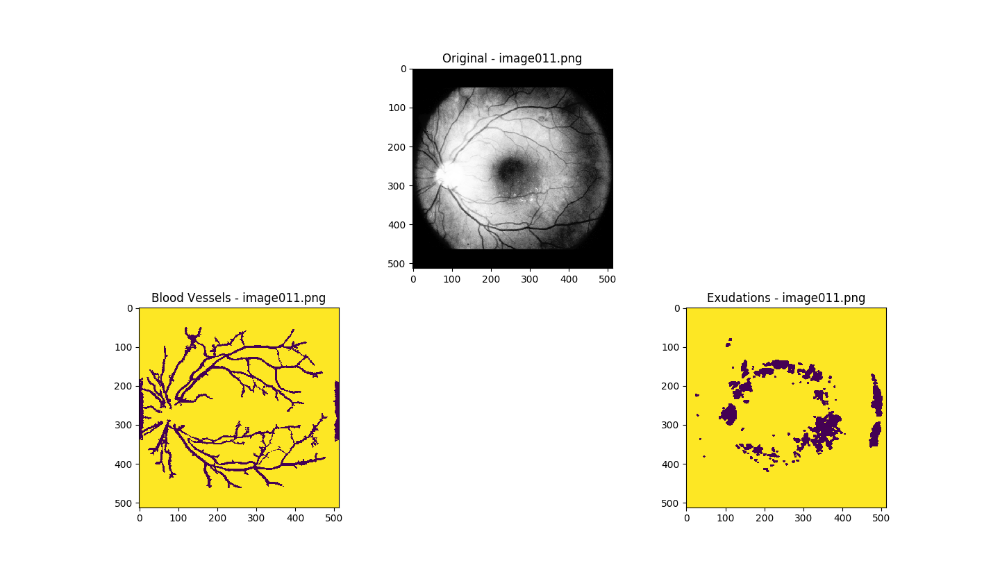

# Automatic Detection of Diabetic Retinopathy with Deep Learning

## Running the script

Make sure you have the following libraries installed:
* tqdm
* tensorflow
* keras
* matplotlib
* numpy
* pandas
* requests
* colorama
* scikit-learn
* opencv

by running the following command:

`pip install -r requirements.txt`

Next, run the main script using the command:

`python main.py`

The main script downloads [DIARETDB0](http://www.it.lut.fi/project/imageret/diaretdb0/) from the website if not already available in your current directory, and unzips it. A series of functions are called to normalise the images, annotate them for classes using a scoring function, create a dataframe, and finally pass it to our Convolutional Neural Network for training.

Training history can be visualised on Tensorboard using the following command:

`tensorboard --logdir = ./logs`

Running the script for 200 epochs gave us a baseline accuracy of 80%. Currently, we are working on improving our model to increase accuracy scores on the test dataset.

## Scoring Function

The annotations are stored as `.dot` files in the downloaded data directory: `diaretdb0_v_1_1/resources/images/diaretdb0_groundtruths/`. The files contain annotations in the format: `redsmalldots hemorrhages n/a n/a n/a` which accounts for 5 levels of fundus in Diabetic Retinopathy images, in ascending order of severity.

We convert this annotation into a 5-bit binary number and then find its decimal equivalent as follows:

* `n/a` is accepted as `False` or `0`
* Everything else is regarded as `True` or `1`

Our scoring and class function adhere to the following rules:

| Lower Limit | Upper Limit | Class |
| ----------- | ----------- | ----- |
| 0 | 0 | 0 |
| 1 | 1 | 1 |
| 2 | 12 | 2 |
| 13 | 32 | 3 |

Example:

| Image | 2^0  | 2^1 | 2^2 | 2^3 | 2^4 | Score | Class |
 ------------- | ------------- | ------------- | ------------- | ------------- | ------------- | ------------- | ------------- |
| image113.dot | n/a  | n/a | n/a | n/a | n/a | 0 | 0 |
| image060.dot | redsmalldots  | n/a | n/a | n/a | n/a | 1 | 1 | 
| image081.dot | redsmalldots  | haemorrhages | n/a | n/a | n/a | 3 | 2 | 
| image011.dot | redsmalldots  | haemorrhages | hardexudates | softexudates| n/a | 31 | 3 | 

## Visualising the Dataset

To visualise the dataset images, run:

`python scripts/feature_extraction.py --img <IMAGE>`

where `<IMAGE>` can have values as `image001.png`, `image002.png` till `image130.png`. Running the script should give you the results such as the following:

Example: `python scripts/feature_extraction.png --img image011.png`

The blood vessels have been separated from the exudates.

## Tasks:

* [x] Image Preprocessing
* [x] Train Model
* [ ] Annotation GUI using Tkinter 
* [ ] Unsupervised Clustering of images

## Group Members:

* Sumit Saha - <a href="mailto:sumit.saha.acad@gmail.com" target="_top">sumit.saha.acad@gmail.com</a>
* Ishan Bhattacharya - <a href="mailto:ishan98b@gmail.com" target="_top">ishan98b@gmail.com</a>
